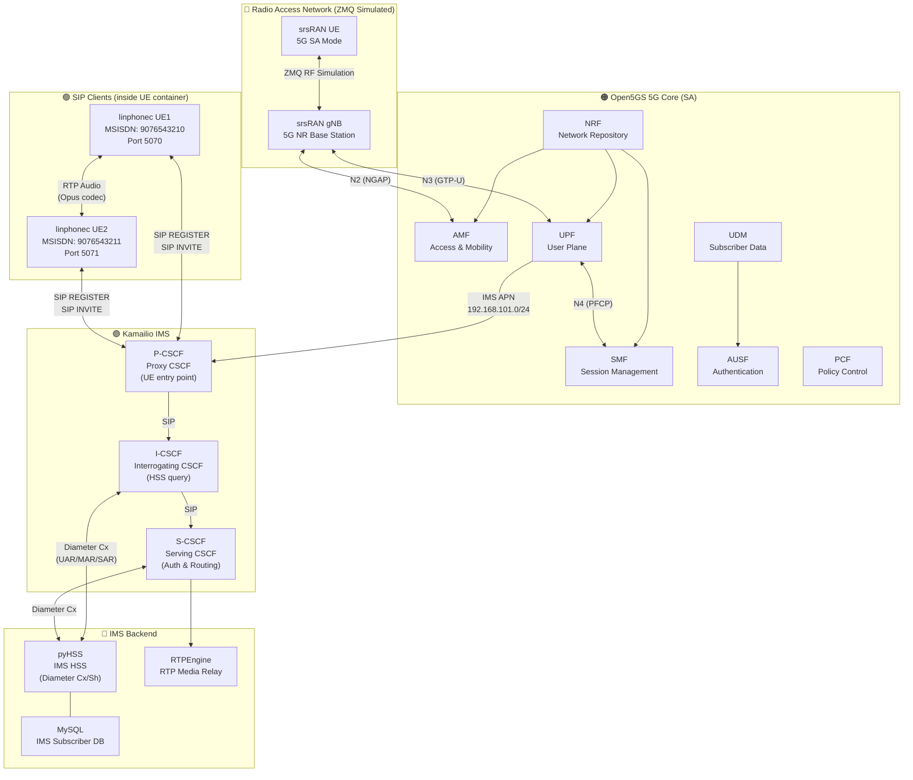
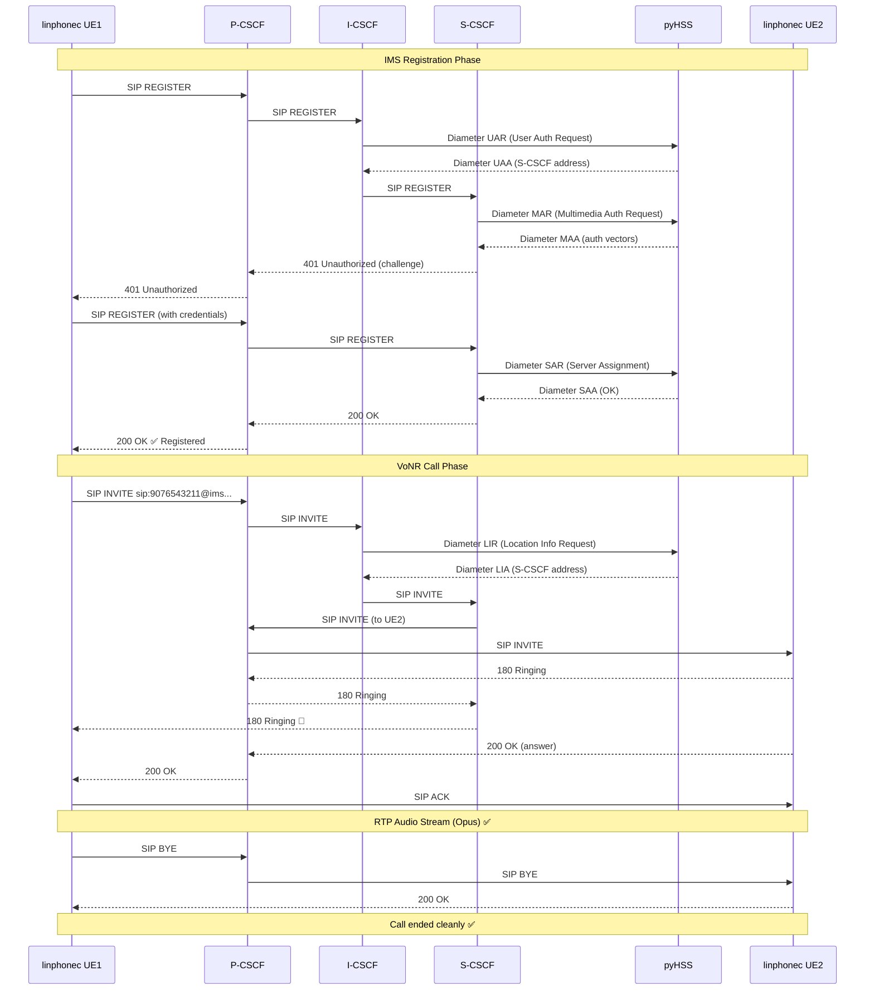
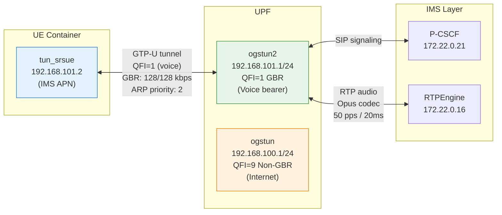
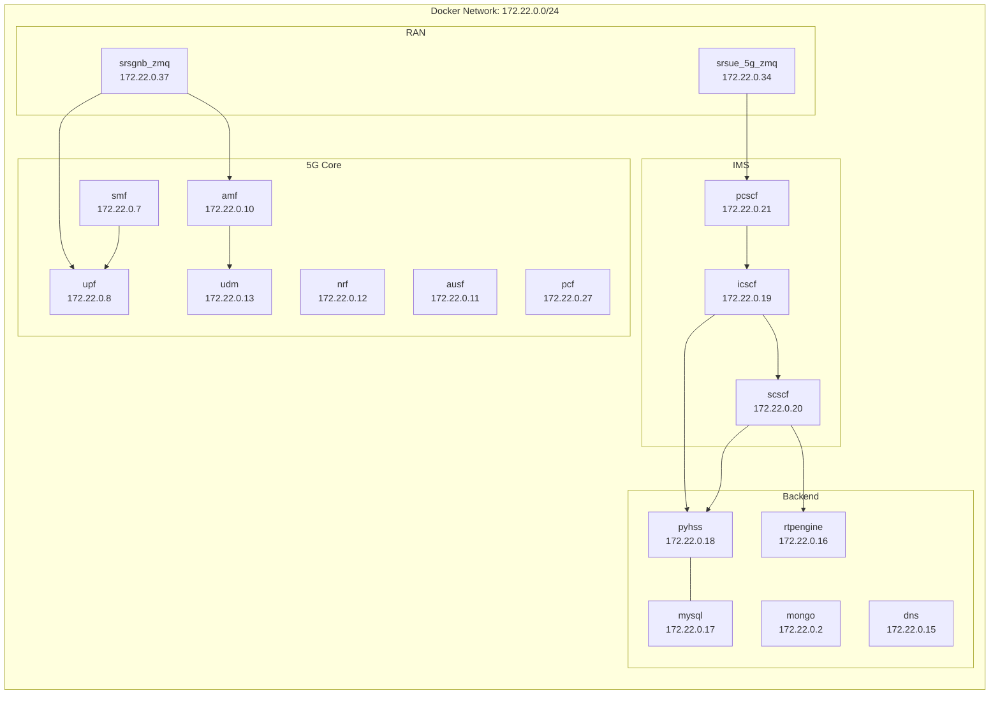
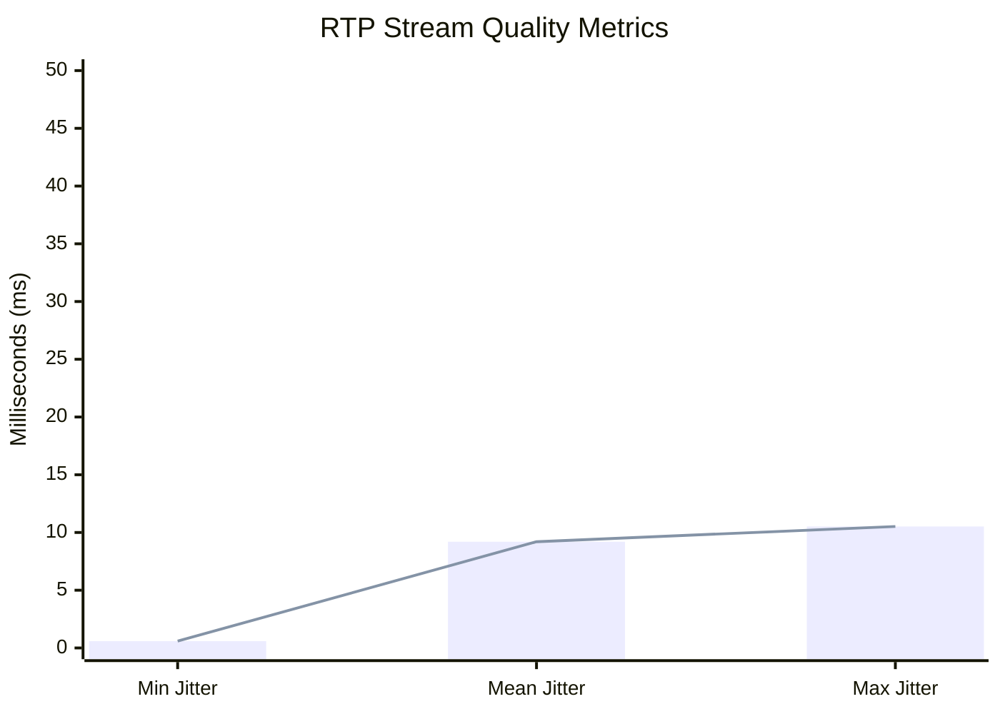

# VoNR Architecture

## System Overview

---

## SIP Call Flow

---

## QoS Flow Architecture

---

## Container Network Map

---

## Measured Performance

| Metric | Measured | 3GPP Limit | Status |
|--------|----------|------------|--------|
| Packet Loss | 0.0% | < 1% | ✅ Pass |
| Mean Jitter | 9.2 ms | < 50 ms | ✅ Pass |
| Max Jitter | 10.5 ms | < 50 ms | ✅ Pass |
| MOS Score | 3.58 | > 3.5 | ✅ Pass |
| Registration | 318 ms | < 500 ms | ✅ Pass |
| Teardown | 10 ms | < 500 ms | ✅ Pass |
| Codec | Opus | AMR-WB | ✅ Good |
